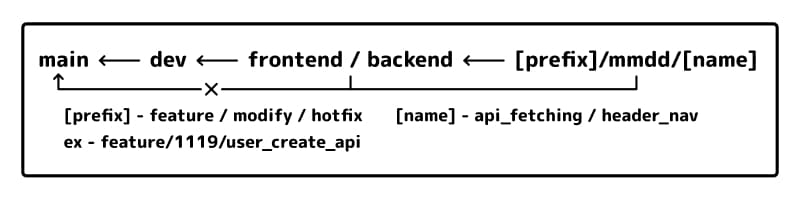

## ディレクトリ設計

- Components - Atomic Design
- Redux - Re-ducks Pattern

## ブランチ運用ルール



- "main"ブランチにマージする際は"dev"ブランチを必ず経由する
- フロントエンドの実装は"frontend"、バックエンドの実装は"backend"のブランチに集約する
- 作業ブランチは「種別/月日/内容」のブランチを発行し、ブランチの命名にあった作業を行う（例：feature/1119/user_create_api）
- 作業ブランチはリモート上に残さない

## バックエンド開発コマンド

```bash
NestJS CLI コマンドリファレンス
nest g mo [name] // モジュール作成コマンド
nest g co [name] // コントローラー作成コマンド
nest g s [name] // サービス作成コマンド
```

---

## Directory Design

- Components - Atomic Design
- Redux - Re-ducks Pattern

## Branch Operation Rules


- When merging into the "main" branch, make sure to go through the "dev" branch.
- Frontend implementation should be consolidated into the "frontend" branch, and backend implementation into the "backend" branch.
- Create working branches with the format "type/date/description" and perform tasks corresponding to the branch name (e.g., feature/1119/user_create_api).
- Do not keep working branches on the remote repository.

## Backend development commands

```bash
NestJS CLI command reference
nest g mo [name] // Module creation command
nest g co [name] // Controller creation command
nest g s [name] // Service creation command
```
